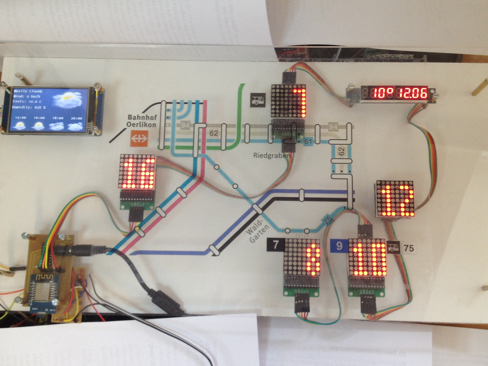

# ZVV-and-Weather
Real Time departure times of Zurich transportation system and weather display with Wemos D1

This panel hangs near my main door for everybody to see the next connections of near by trams, 
buses and trains.
In addition you get a clock, outside temperature as well as weather forecast data.
All the departure times displayed are real time data from the ZVV API and do consider walking times 
to the appropriate station. Departure times are updated every 30 seconds
[] (https://github.com/mrohner/ZVV-and-Weather/)

### Hardware requirements:
* 1 x Wemos D1 mini
* 1 x Nextion display (I used a 3.2 inch model)
* An appropriate number of MAX7219 dot matrix modules (8x8 dots)
* 1 x MAX7219 8-Digit 7 Segment Digital LED Display Tube (the Max7219s are all daisy chained)
* 1 x Power supply 5V 4A
* 1 x SN74HCT125 Quadruple Bus Buffer Gates With 3-State Outputs (basically to convert 3.3V signals
  from the Wemos to 5V signals for the MAX7219
* optional for backlights and movement detection (to save Power after all)
  * 1 x PIR sensor
  * 1 x 2N2222 over a 1K resistor
* a PCB board, plexiglass board

### Contributions:
* [ThingPulse ESP8266 Weather Station] (https://github.com/ThingPulse/esp8266-weather-station)
* [VClouds Weather Icons©] (http://vclouds.deviantart.com/gallery/#/d2ynulp)
* JSON Streaming Parser by Daniel Eichhorn

### ZVV API (unsupported by ZVV though)
http://online.fahrplan.zvv.ch/bin/stboard.exe/dny?input=Z%C3%BCrich,+Riedgraben&dirInput=Zürich,+Hallenbad+Oerlikon&maxJourneys=2&boardType=dep&start=1&tpl=stbResult2json&time=9:32
The names of the stations have to exactly match what you see when using https://online.fahrplan.zvv.ch/bin/query.exe/dn.html
Umlauts have to be represented in the query by i.e ü = %C3%BC (see Wemos_get_ZVV_V2.4.ino)
In this .ino file you find different scenarios such as:
* Dest1 From Zürich,Riedgraben direction to Hallenbad Oerlikon. Walking time to station 6 minutes
There are several bus lines serving this station going pretty much the same way. I'm interseted in 2 connections and take the earliest to display on my panel
(The response from the API is sorted by planned departure time, I'm interested in real departure time thus have to have at least 2 connections and sort by real departure time).
* Dest2 From Zürich,Waldgarten direction to Zürich, Milchbuck. Walking time to station 7 minutes
There are two tram lines going to different places. I'm interested in both. So I ask for 4 connections and take the faster one of each tram line to display.
* Dest3  is similar to case Dest1
* Dest4 Z%C3%BCrich,+Oerlikon+(SBB)&dirInput=Z%C3%BCrich+HB. I'm interested in a train connection that I can get after having taken the bus (Dest1)
Thus requested departure time of such a train is departure time from Dest1 plus commute time (8 minutes in this case).
I also flag the Inter Regio trains with a dot on the respective Matrix display.

### Nextion Display
[] (https://github.com/mrohner/ZVV-and-Weather/)
I check sunset and sunrise time in order to decide which icons to display (the ones with the moon or the sun)
I display current weather conditions (big icon) and 4 forecast icons (smaller icons) for every two hours. e.g. current time is 10:00 you will be able to see forecast
for 12:00, 14:00, 16:00 and 18:00

